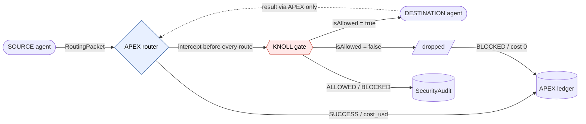
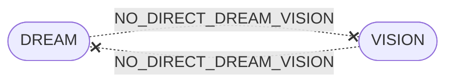
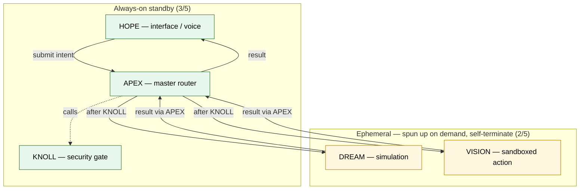
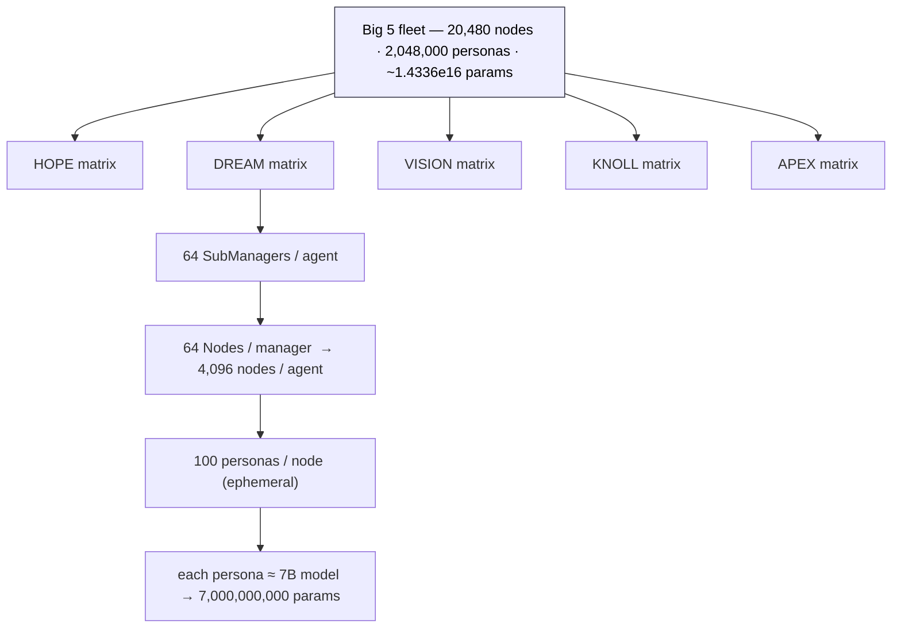
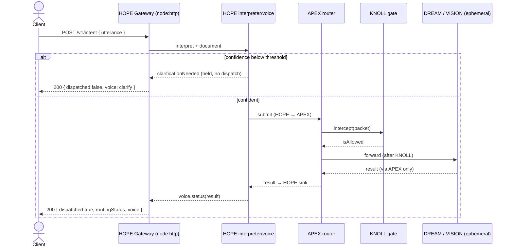
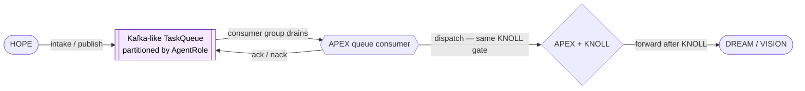

# BIG 5 MATRIX — ARCHITECTURE

Mermaid diagrams for the core flows. See [`GAME_PLAN.md`](./GAME_PLAN.md) for the narrative
and [`../.cursorrules`](../.cursorrules) for the binding constitution.

---

## 1. Packet flow: SOURCE → APEX → KNOLL → DEST

Every inter-agent exchange is a `RoutingPacket` minted by APEX, gated by KNOLL, and only
then delivered. A deny drops the packet and writes a `BLOCKED` ledger + audit row.



**Forbidden edge (always BLOCKED):**



---

## 2. Always-on vs ephemeral



Ephemeral DREAM/VISION also back **horizontal Colab workers**: claim a slice → run a persona
batch → report a payload for APEX re-ingestion → self-terminate.

---

## 3. Node matrix hierarchy

Each Big AI owns an identical 4,096-node matrix; personas are ephemeral leaves.



```
20,480 nodes × 100 personas × 7B params = 1.4336e16  (~14.3 quadrillion)
```

---

## 4. HOPE voice loop (HTTP gateway → APEX → back to voice)

The Phase 4 gateway gives HOPE a forward-facing HTTP presence. It is a composition root: it
wires DREAM/VISION as injected handlers and never addresses them directly.



**Read-only endpoints** (`/v1/health`, `/v1/ledger`, `/v1/audit`, `/v1/matrix/stats`) are
projections over the always-on core state; they never route or mutate anything.

---

## 5. Async intake via the task queue (Phase 4)



The queue is **pure transport**. Draining calls the same `dispatch` path, so async intake is
gated by KNOLL identically to the synchronous path — the queue never bypasses APEX.
